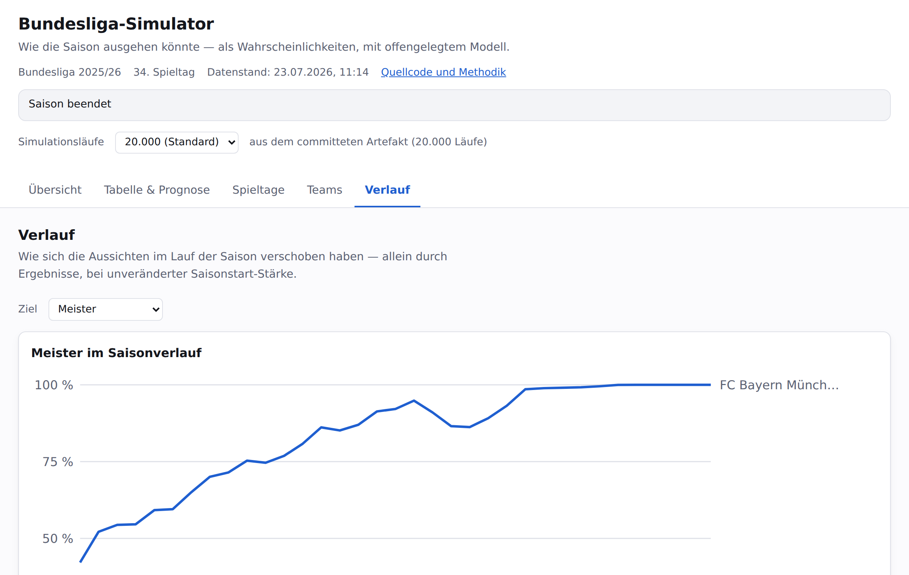

# Bundesliga-Simulator

Wie die Bundesliga-Saison ausgehen könnte — als Wahrscheinlichkeiten, mit
offengelegtem Modell.

**→ [manganite.github.io/bundesliga](https://manganite.github.io/bundesliga/)**

## Was die App zeigt

**Übersicht** — der Stand der Saison in sechs Karten: Titelrennen,
Abstiegskampf, Platzierungszonen, der letzte Spieltag, der Spannungsindex und
was bereits entschieden ist. Karten, die nichts zu sagen haben, blenden sich
aus.

**Tabelle & Prognose** — die aktuelle Tabelle neben dem simulierten Saisonende,
mit erwarteten Punkten und dem Bereich, in dem 80 % der simulierten Saisons
landen. Die Heatmap darunter zeigt für jeden Klub, wie wahrscheinlich jeder
einzelne Tabellenplatz ist.

**Spieltage** — Ergebnisse und Vorhersagen je Spieltag, die Tabelle wie sie
danach stand, und wer sich am weitesten bewegt hat. Dazu die größten
Überraschungen, gemessen daran, wie unwahrscheinlich das Ergebnis vorher war.

**Teams** — ein Klub im Detail: wo die Saison für ihn endet, wie sich seine
Titelchance entwickelt hat, was noch aussteht, und ob er mehr oder weniger
Punkte geholt hat als erwartet.

**Verlauf** — wie sich die Aussichten über die Saison verschoben haben. Die
Kurven verwenden durchgehend die Stärke vom Saisonstart und zeigen deshalb
ausschließlich, was die Ergebnisse bewirkt haben.

Die Prognose verändert sich durch neue Ergebnisse und aktualisierte Ratings. Die
Modellparameter bleiben während der Saison unverändert.

## Das Modell

Jedes Spiel ist ein Poisson-Modell mit Dixon-Coles-Korrektur für niedrige
Ergebnisse, gespeist aus den Elo-Ratings von clubelo. Daraus wird die Saison
zehntausendfach durchgespielt; gezählt wird, wie oft welcher Klub wo landet.

Dass niemand die wahre Stärke eines Klubs kennt, steckt als `RATING_SIGMA` im
Modell: jeder Lauf zieht für jeden Klub eine eigene hypothetische Stärke. Ein
Favorit gewinnt deshalb nicht in jedem Lauf.

Was sich davon belegen lässt und was ausdrücklich nicht, steht in
[docs/MODEL_EVIDENCE.md](docs/MODEL_EVIDENCE.md). Die Fitprozedur selbst liegt
in [packages/fit](packages/fit) und ist damit nachvollziehbar.

## Quellen und Lizenzen

- **Ergebnisse und Spielpläne:** [OpenLigaDB](https://www.openligadb.de/), unter
  der [Open Database License (ODbL) 1.0](https://opendatacommons.org/licenses/odbl/1-0/).
  Die hier committeten, daraus abgeleiteten Datendateien stehen ihrerseits unter
  der ODbL und nennen ihre Quelle je Datei.
- **Ratings:** [clubelo.com](http://clubelo.com/). clubelo veröffentlicht keine
  Lizenz, aber der Betreiber hat am **2026-07-23** ausdrücklich erlaubt, die
  Ratings so abzurufen wie hier beschrieben **und** die daraus abgeleiteten
  Snapshots öffentlich weiterzugeben. Wortlaut und Umfang stehen in
  [docs/verification/clubelo.md](docs/verification/clubelo.md). Die committeten
  Rating-Dateien unter `data/ratings/` stehen deshalb **nicht** unter der ODbL,
  sondern unter dieser Erlaubnis, und nennen sie je Datei im `source`-Feld.
  Die Erlaubnis ist kein Freibrief: abgerufen wird so sparsam wie möglich, im
  eingeschwungenen Zustand **einmal am Tag**. Einzelne Klubs können vorübergehend
  mit einem älteren Rating rechnen, wenn clubelo sie gerade nicht fortführt — die
  App markiert diese Klubs und nennt das Datum.
- **Code:** GPL-3.0, siehe [LICENSE](LICENSE).

Code und Daten stehen unter verschiedenen Lizenzen, und die beiden Datenquellen
untereinander ebenfalls. Das ist Absicht und darf nicht vermischt werden.

Der Tabellenrechner folgt der DFL-Spielordnung. Gegen 22 echte Abschlusstabellen
beider Ligen geprüft sind damit das Einstiegskriterium Punkte sowie Tordifferenz
und erzielte Tore; **keine** dieser Saisons brauchte den direkten Vergleich. Der
ist durch Testfälle abgedeckt, die aus dem Wortlaut der Spielordnung konstruiert
sind — nicht durch echte Tabellen.

## Mitentwickeln

Aufbau, Befehle, Datenpipeline, Zustand und die jährliche Checkliste stehen in
[docs/DEVELOPMENT.md](docs/DEVELOPMENT.md).

Das Repo enthält außerdem ein nicht deploytes, privates Tipp-Hilfswerkzeug unter
`apps/kicktipp` — nicht Teil der Website.
